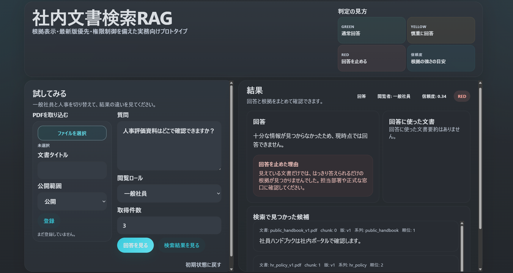
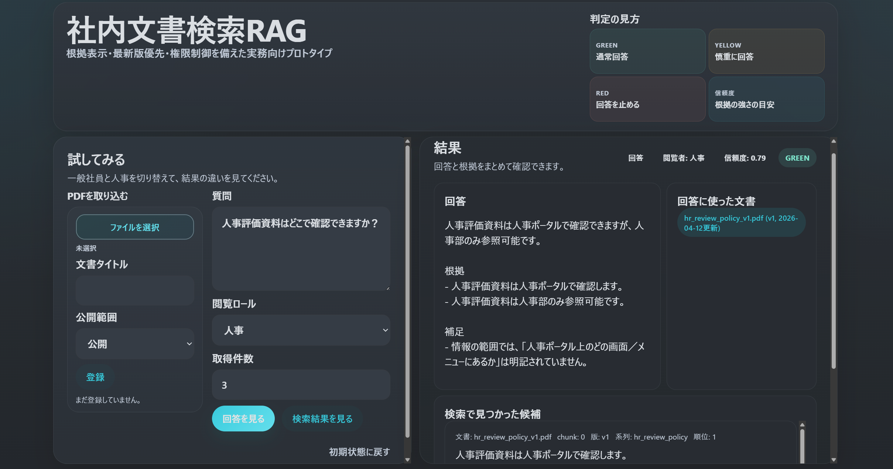
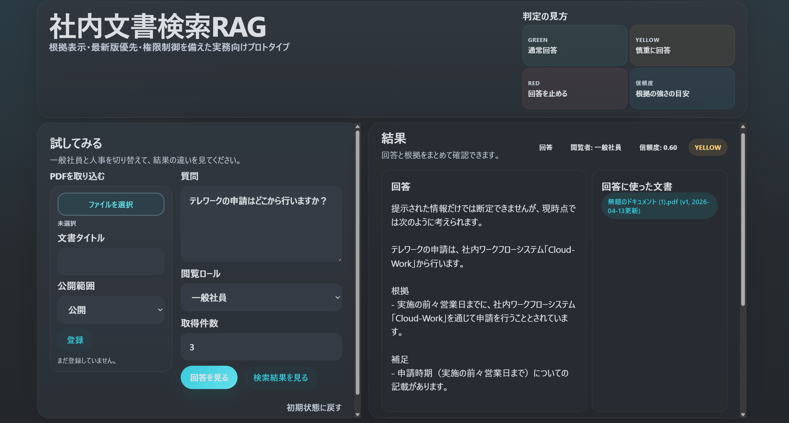

# 実務向け社内文書検索 RAG プロトタイプ

社内ナレッジ検索を想定した、実務寄りの RAG プロトタイプです。

> このリポジトリは、ローカルで動かすポートフォリオ用プロトタイプであり、本番運用向けサービスではありません。  
> 実在の API キー、社内文書、個人情報、業務上の機密データはコミットしないでください。

## ポートフォリオ概要

このプロジェクトは、単なる RAG デモから一歩進んで、社内文書検索の実務課題に近い論点を扱うために作った backend 主体のプロトタイプです。

このプロトタイプが主に向き合っている課題:

- 根拠を示せない回答は、検索できても実務では使いにくい
- 同じ文書の旧版と新版が混ざると危険
- inactive な文書は管理対象として残しつつ、検索対象には含めたくない
- 権限外文書が retrieval や回答に混ざるのは危ない
- 根拠が弱いときは、安全側で回答を止めたい

実装済みのもの:

- query rewrite と rerank を含むハイブリッド検索
- `green / yellow / red` による根拠ベースの回答制御
- 文書ライフサイクル管理: 登録 / 参照 / 更新 / inactive 化 / 削除
- `version`、`updated_at`、`document_group` を使ったメタデータ考慮 retrieval
- `access_level` と `user_role` による最小 ACL
- retrieval / 回答挙動 / 文書更新 / アクセス制御に対する回帰テスト

このプロジェクトで見せたいこと:

- 実務で起きやすい RAG の失敗パターンを理解していること
- retrieval、回答生成、文書管理、評価を責務分離できること
- 手動 QA から自動回帰確認へ寄せられること
- 版管理やアクセス制御のような運用概念を、最初の実装で過剰に複雑化せずに入れられること

つまりこのリポジトリは、完成した本番システムというより、**社内文書検索 RAG の実務課題のコア部分を解き始めているプロトタイプ** と捉えるのがいちばん正確です。

特に、現実の業務でよく問題になる次の点には直接触れています。

- 根拠が弱いのにもっともらしく答えてしまう
- 同じ規程の旧版と新版が混ざる
- inactive 文書を誤って拾う
- 権限外文書が retrieval や回答に混ざる
- 会話ベースの手動 QA に依存して再現できない

まだ本番レベルでは未解決の課題:

- 本物の認証と ID 連動の認可
- チーム / プロジェクト / 個人レベルまで含む多段 ACL
- 監査ログと運用トレーサビリティ
- 崩れた PDF や他形式文書を含む取り込み品質
- 中規模以上の文書群に対する retrieval 品質評価

## 現在の到達点

- **Backend**  
  retrieval、回答生成、文書管理、active / inactive 制御、最新版優先、最小 ACL、PDF upload、delete API まで実装済みです。
- **UI**  
  `/demo` で、検索、回答確認、ACL の差、PDF 取り込み、`green / yellow / red` の挙動を 1 画面で確認できます。
- **Quality**  
  retrieval、回答挙動、アクセス制御、文書更新、PDF upload、delete の挙動を回帰テストで確認しています。
- **Docs**  
  README、アーキテクチャ説明、QA メモで、「何を実装したか」「どこを意図的に最小にしているか」「本番では何が会社依存か」を説明しています。

## デモ UI

ポートフォリオ用 UI は `http://127.0.0.1:8000/demo` で確認できます。

このデモでは、次の 3 つの挙動が見やすいようにしています。

1. `一般社員 -> red`  
   権限外、または根拠が弱い質問に対しては、もっともらしく答えず安全に停止します。
2. `人事 -> green`  
   同じ質問でも、人事ロールなら人事向け文書を使って回答できます。
3. `PDF upload -> yellow`  
   新しくアップロードした PDF をすぐ検索対象にしつつ、根拠が十分でなければ慎重に回答します。

ポートフォリオで載せるスクリーンショット例:

- `一般社員` が `人事評価資料はどこで確認できますか？` と質問
  - `red` による安全停止
  - 権限外文書が混ざらないこと
  - fallback 挙動
- `人事` が同じ質問
  - ACL ベースの retrieval
  - 根拠付き回答
  - `used_source_summaries`
- PDF upload 後に `テレワークの申請はどこから行いますか？`
  - 取り込み
  - upload 後の retrieval
  - `yellow` の慎重回答

### スクリーンショット: `一般社員 -> red`

一般社員では、十分な根拠を集められない質問に対して回答を停止する例です。



### スクリーンショット: `人事 -> green`

人事ロールでは人事向け文書にアクセスできるため、同じ質問でも根拠付きで回答できます。



### スクリーンショット: `PDF upload -> yellow`

PDF をアップロードして検索対象に追加し、根拠の強さに応じて慎重に回答する例です。



## このプロジェクトがカバーする範囲

- 文書取り込み
- 段落寄りの chunking
- OpenAI を使った embedding 生成
- Postgres + pgvector によるベクトル検索
- retrieval 結果を使った回答生成
- 出典を意識したレスポンス
- 文書メタデータ管理
- active / inactive 文書制御

## アーキテクチャ概要

主な backend の流れ:

1. 文書は `version`、`is_active`、`document_group`、`access_level` などのメタデータ付きで保存される
2. 文書本文は chunk 化され、retrieval 用 embedding が作られる
3. `/search` では active filter、ACL filter、最新版優先、hybrid score、rerank を順に適用する
4. `/ask` は同じ retrieval pipeline を使い、取得できた根拠からだけ回答する
5. 回答挙動は 2 値ではなく `green / yellow / red` で制御する

重要な設計判断:

- `document_group` で同系列文書の複数版を束ねる
- 最新版判定は `updated_at` を主軸にし、`version` は tie-break として使う
- `access_level` は会社依存の本格 auth を作り込まず、ACL の概念だけ見せる最小実装にしている
- `used_sources` と `used_source_summaries` により、retrieval 候補と実際に回答へ使った根拠を分けている

## クイックスタート

### 1. DB を起動

```powershell
docker compose up -d
```

### 2. 現在のターミナルに API キーを設定

```powershell
$env:OPENAI_API_KEY="sk-..."
```

API キーはローカルシェルやローカル環境ファイルでのみ扱い、Git には含めないでください。

### 3. API サーバーを起動

```powershell
uv run uvicorn app.main:app --reload
```

### 4. API ドキュメントを開く

- `http://127.0.0.1:8000/docs`

## 主なエンドポイント

### システム

- `GET /health`
- `GET /db-health`

### 文書管理

文書を登録・参照・更新・inactive 化しつつ、chunk 化された retrieval データとの整合も保つためのエンドポイントです。

- `POST /documents`
- `GET /documents`
- `GET /documents/{document_id}`
- `PATCH /documents/{document_id}`
- `PATCH /documents/{document_id}/active`
- `DELETE /documents/{document_id}`
- `GET /documents/{document_id}/chunks`
- `POST /documents/upload/pdf`

### Retrieval

- `POST /search`

### 回答

- `POST /ask`

## 文書メタデータ方針

各文書は次のメタデータを持ちます。

- `version`: `v1` のようなシンプルな版ラベル
- `is_active`: 現在の retrieval / 回答対象に含めるか
- `document_group`: 同系列文書の複数版をまとめるキー
- `access_level`: `public` や `hr` のような簡易アクセスラベル
- `created_at`: 初回登録日時
- `updated_at`: メタデータ更新日時

### 文書更新の挙動

- `PATCH /documents/{document_id}` で `title`、`source`、`content`、`version`、`is_active`、`document_group`、`access_level` を更新できます
- `title`、`source`、`content` が変わると chunk を再構築します
- 再構築した chunk は、最新の `title + chunk content` を使って再 embedding します
- これにより `updated_at` が active フラグ変更だけでなく、実際の内容更新を反映する値として意味を持ちます

#### 例: 既存文書を更新する

リクエスト:

```json
{
  "title": "育児休業の申請ルール",
  "source": "childcare_policy_v2.pdf",
  "content": "育児休業は人事システムから申請します。\n育児休業の延長申請は人事ポータルから行います。\n延長申請には本人確認書類の添付が必要です。\n申請期限までに上長確認を完了してください。",
  "version": "v2",
  "is_active": true,
  "document_group": "childcare_policy",
  "access_level": "public"
}
```

使用先:

```powershell
PATCH /documents/1
```

### active / inactive の挙動

- inactive 文書は `GET /documents` では見える
- inactive 文書は `POST /search` から除外される
- `POST /ask` も同じ retrieval pipeline を使うため、inactive 文書は回答にも使われない

### アクセス制御の挙動

- 文書は `access_level` 付きで登録される
- `public` 文書はすべての `user_role` から見える
- 非公開文書は、`user_role` が `access_level` と一致するときだけ見える
- `POST /search` と `POST /ask` は `user_role` を受け取り、retrieval 前に同じアクセスフィルタを適用する

#### 例: 特定ロールで検索する

```json
{
  "query": "人事評価資料はどこで確認できますか？",
  "top_k": 3,
  "user_role": "hr"
}
```

### 回答の安全制御

回答 pipeline は次を返します。

- `used_sources`: 回答に実際に使った retrieval 結果
- `answer_level`: `green`、`yellow`、`red`

意味:

- `green`: 根拠が十分で通常回答できる
- `yellow`: 回答は返すが、慎重なトーンにする
- `red`: 根拠が弱いため回答を止める

`confidence` も返しますが、これは `used_sources` の平均スコアをベースにした参考値であり、単独で回答可否を決める値ではありません。

## 開発メモ

- ローカル DB として Docker 上の Postgres + pgvector を使っています
- OpenAI API キーは環境変数で渡します
- 現在はローカル開発向けに `Base.metadata.create_all()` を使っています
- 本番運用を意識するなら、migration、監査ログ、より厳密な認可、より厚い評価が必要です

## GitHub 公開時の注意

- このリポジトリはローカル開発とポートフォリオ公開を前提にしています
- 実在の社内文書、個人情報、会社の機密 PDF は公開しないでください
- 自作サンプル、明確に架空の文書、再配布権のある素材だけを含めてください
- 公開前に、API キー、`.env`、ローカル DB、ログ、一時ファイルが含まれていないことを確認してください

## 次にやるなら

次のうち一部は会社依存が強いため、このプロトタイプでは意図的に実装を止めています。

- リクエストボディの `user_role` ではなく、認証連動のアクセス制御
- 部署 / プロジェクト / 個人まで含む多段 ACL
- 誰が何を検索し、どの根拠を使ったかの監査ログ

一方で、会社が変わっても共通しやすい次の課題も残っています。

- PDF や他形式文書に対する取り込み品質向上
- 中規模以上の文書群に対する retrieval 評価の強化
- `red` のときの導線や根拠確認を含む軽量 UI 改善

## 詳細ガイド

[docs/development-guide.md](/C:/Users/estor/RAG/docs/development-guide.md) では次を扱っています。

- 起動時の注意
- テスト方針
- 安全な変更境界
- コーディング方針
- デプロイ時の注意
- 重要ファイル

[docs/architecture-overview.md](/C:/Users/estor/RAG/docs/architecture-overview.md) では次を扱っています。

- backend の責務分割
- retrieval と回答の流れ
- 版管理と ACL の設計判断
- このプロトタイプで意図的に最小に留めている部分
